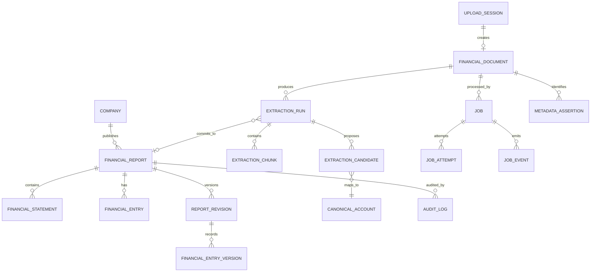

# 02 — Domain Model and ERD

## Core ERD



## Existing entities retained

- `Company`
- `FinancialReport`
- `FinancialStatement`
- `FinancialEntry`
- `CanonicalAccount`
- `ExtractionRun`
- `ExtractionChunk`
- `ExtractionCandidate`
- `AuditLog`

## Proposed additions

### FinancialDocument

Represents one immutable uploaded source object.

Key fields:

- `id`
- `storageProvider`
- `bucket`
- `objectKey`
- `originalFileName`
- `mimeType`
- `verifiedSize`
- `sha256`
- `magicBytesVerified`
- `documentStatus`
- `uploadedBy`
- timestamps

### UploadSession

Tracks upload transport independently from extraction.

Key fields:

- `id`
- `documentId?`
- `uploadMode`: `SINGLE_PUT | MULTIPART`
- `providerUploadId?`
- `objectKey`
- `expectedSize`
- `partSize`
- `status`
- `resumeTokenHash`
- `expiresAt`
- `lastPartNumber`
- timestamps

### Job

Generic durable work item.

Key fields:

- `id`
- `type`
- `status`
- `priority`
- `payload`
- `deduplicationKey`
- `attemptCount`
- `maxAttempts`
- `availableAt`
- `claimedBy`
- `claimedAt`
- `leaseExpiresAt`
- `lastHeartbeatAt`
- `errorCode`
- `errorMessage`
- timestamps

### MetadataAssertion

Separates detected metadata from final confirmed report identity.

Key fields:

- `documentId`
- `field`: ticker, company, year, period, currency, unit, consolidation scope, audit status
- `proposedValue`
- `confidence`
- `sourcePage`
- `sourceText`
- `status`: proposed, confirmed, rejected
- reviewer audit fields

### ReportRevision

Preserves revised filings and canonical corrections.

Key fields:

- `reportId`
- `revisionNumber`
- `revisionType`: source refiling, data correction, restatement
- `supersedesRevisionId?`
- `status`
- `effectiveAt`
- `reason`

## Required changes to FinancialReport

The existing uniqueness rule `(companyId, year, periodType)` is insufficient for revised filings. Replace it conceptually with one of:

```text
(companyId, year, periodType, revisionNumber)
```

or a separate stable `reportSeriesKey` plus revisions.

Recommended fields:

- `periodBasis`: `YTD | STANDALONE | POINT_IN_TIME`
- `filingScope`: `CONSOLIDATED | PARENT_ONLY`
- `revisionNumber`
- `isCurrentRevision`
- `supersededById?`
- `sourceDocumentId?`

## Reported versus derived data

Canonical reported facts remain in `FinancialEntry` or a renamed `ReportedFinancialFact`.

Derived values belong in a separate model:

### DerivedFinancialFact

- `companyId`
- `reportId?`
- `canonicalAccountId`
- `metricCode`
- `value`
- `calculationVersion`
- `formula`
- `sourceFactIds`
- `periodBasis`
- timestamps

Example:

```text
Q2 standalone revenue = H1 YTD revenue - Q1 revenue
```

This value must never overwrite either source fact.
