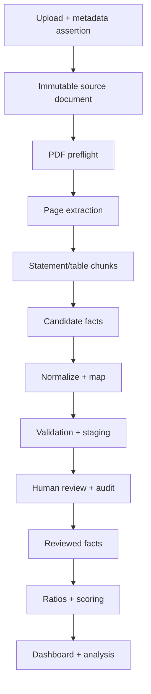

# InvestAI MVP 1.2D architecture freeze

Status: frozen for the production-readiness branch. Stack changes require an explicit architecture decision record.

## Decisions

1. Keep Next.js, TypeScript, Prisma, and PostgreSQL.
2. PostgreSQL is the source of truth for documents, jobs, extraction candidates, review actions, reviewed facts, ratios, scoring, and audit events.
3. Object storage holds source PDF bytes in production. PostgreSQL holds immutable identity, checksum, metadata, and lineage. Temporary database bytes are not a production storage strategy.
4. Prisma migrations own schema creation. Request handlers must never execute DDL.
5. AI may propose structure, metadata, mappings, and candidate values. Runtime validation and human review remain mandatory.
6. Only reviewed financial facts may feed ratios, scoring, narrative analysis, or valuation.
7. Every committed fact retains source document, page, candidate/run, original value, normalized value, currency, unit, sign, reviewer, and timestamps.
8. Extraction is issuer-agnostic. Issuer knowledge belongs in aliases/rules/configuration, not page numbers or ticker branches.

## Pipeline contract

## Readiness invariants

- No candidate becomes a reviewed fact without an explicit review action.
- No reviewed fact exists without source lineage.
- Duplicate document and duplicate processing are idempotent.
- Current and comparative periods are separate facts; the column cannot be inferred from position alone.
- Unit and currency are attributes of every fact, not display-only metadata.
- Component aggregation is allowed only by a canonical aggregation rule and retains every component.
- A subtotal and its components cannot both be summed into the same canonical fact.
- CAPEX and other cash outflows follow one canonical sign convention.
- Health is `ready` only when the application and PostgreSQL query succeed.
- Migration deployment from empty PostgreSQL and persistence across restart are mandatory gates.

## Deferred beyond the foundation

Vector search, Investment Banking integrations, advanced valuation, and autonomous recommendations remain downstream consumers. They cannot become alternate financial sources of truth.
